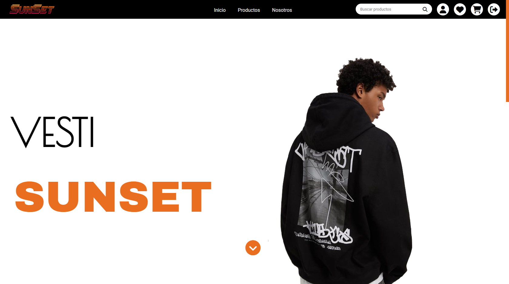
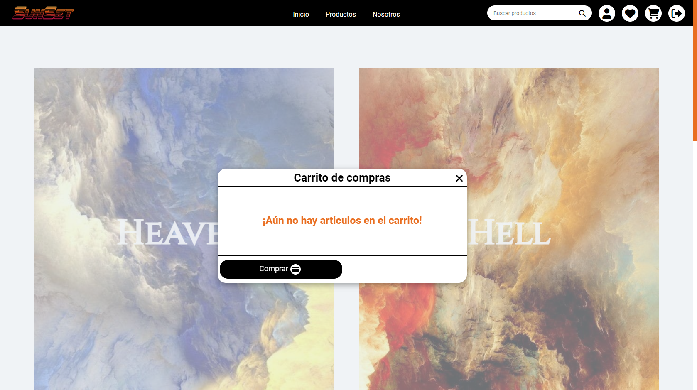
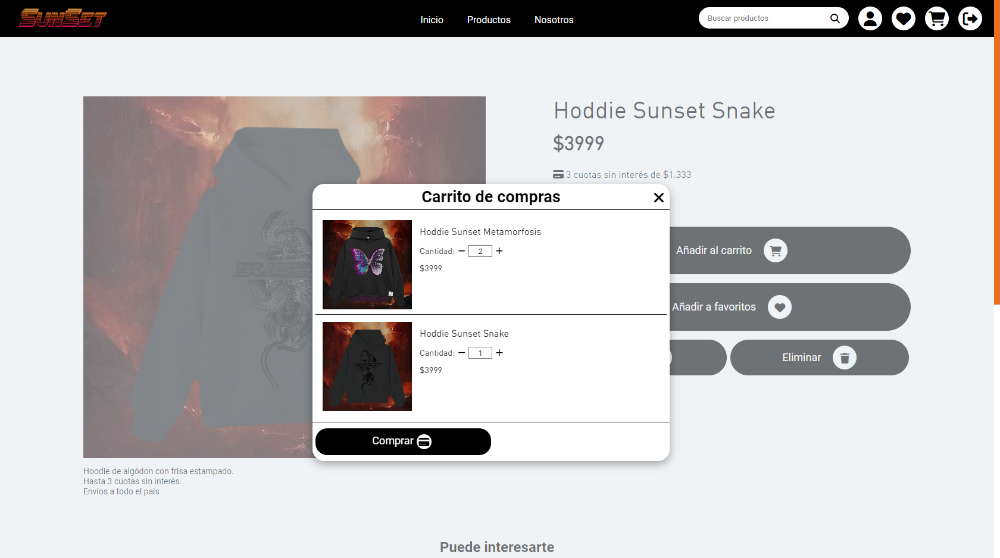
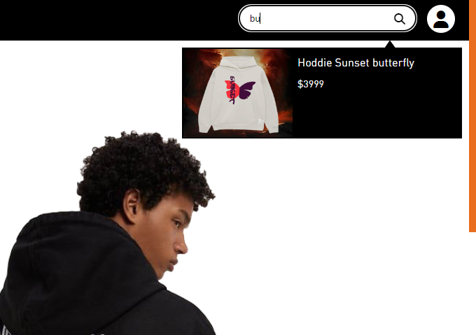
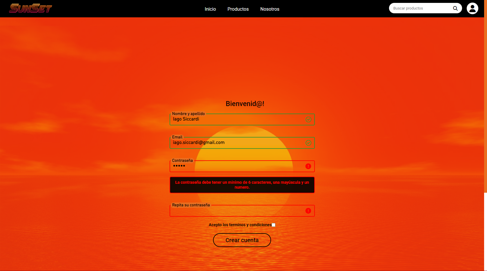
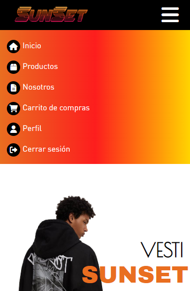
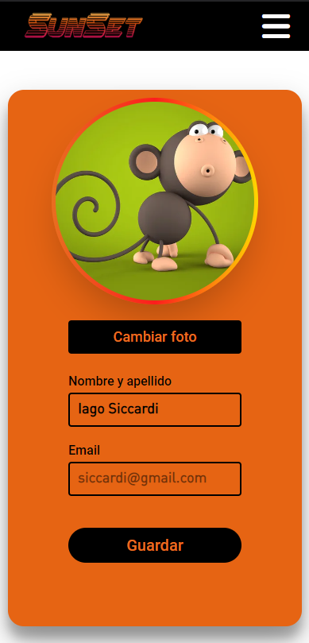

<h1>Sunset</h1>

***Sitio realizado utilizando NodeJS y Express. La base de datos utilizada fue MySQL.*** 

<h2>Caracteristicas</h2>

<ul>
<li>Es responsive.</li>
<li>Capacidad de añadir items.</li>
<li>Posibilidad de iniciar y crear sesión.</li>
<li>Validaciones Frontend y Backend.</li>
<li>Buscador en tiempo real.</li>
<li>Carrito de compras.</li>
</ul>

<h2>Screnshoots</h2>

## Sitios de referencia:

Por las funcionalidades implementadas : [Adidas Argentina](https://www.adidas.com.ar)

Por los clientes hacia los que apunta : [Drop Kings](https://www.dropkings.site)

Por los productos o servicios que ofrece : [Cncpt](https://www.cncpt.com.ar)

Por la estetica que presenta : [MCMXC](https://mcmxc.flashcookie.com/)

***La tematica del proyecto es de Buzos, con un publico objetivo de adolescentes en adelante.***

## Iago Siccardi, 19 años.

