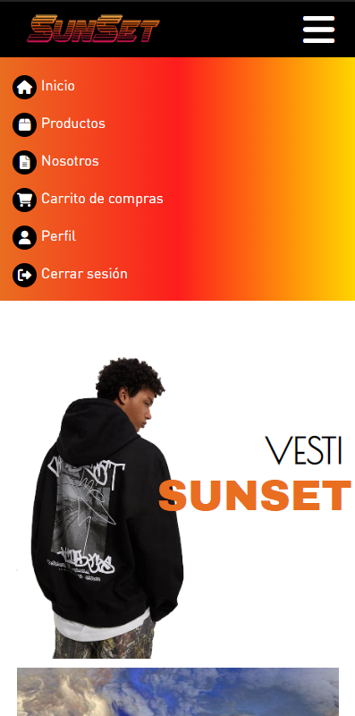
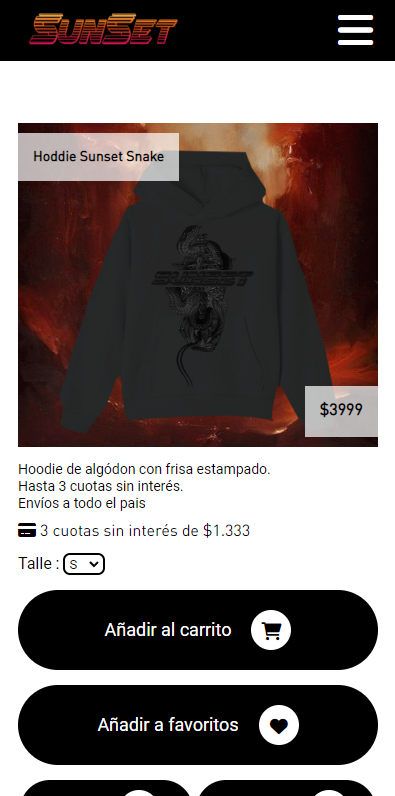
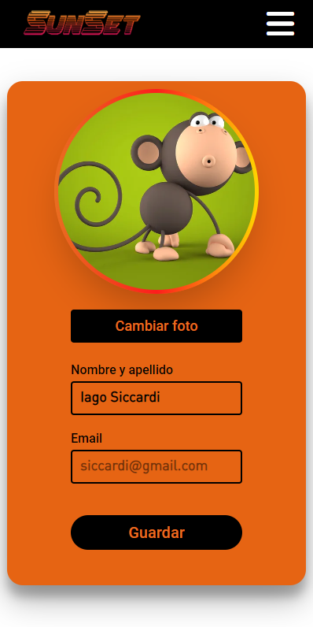

<h1>Sunset</h1>

***Sitio realizado utilizando NodeJS y Express. La base de datos utilizada fue MySQL.*** 

<h2>Caracteristicas</h2>

<ul>
<li>Es responsive.</li>
<li>Capacidad de añadir items.</li>
<li>Posibilidad de iniciar y crear sesión.</li>
<li>Validaciones Frontend y Backend.</li>
<li>Buscador en tiempo real.</li>
<li>Carrito de compras.</li>
</ul>

<h2>Base de datos</h2>

```
Crear el arhivo .env y darle valor a las variables de entorno según corresponda.
```
<ul>
<li>DB_USERNAME=</>
<li>DB_PASSWORD=</li>
<li>DB_DATABASE=sunset_db</li>
<li>DB_HOST=127.0.0.1</li>
</ul>

### Crear la base de datos con **migraciones**
Es necesario tener instalado [sequelize-cli](https://www.npmjs.com/package/sequelize-cli)
```
$ npm install -g sequelize-cli
```
Crear la base de datos
```
$ sequelize db:create
```
Correr migraciones y seeders
```
$ sequelize db:migrate
$ sequelize db:seed:all
```


<h2>Screnshoots</h2>

<h3>Desktop</h3>

<div>


</div>

<h3>Mobile</h3>

<div style="display:flex; flex-wrap:wrap">





</div>

## Iago Siccardi, 19 años.


